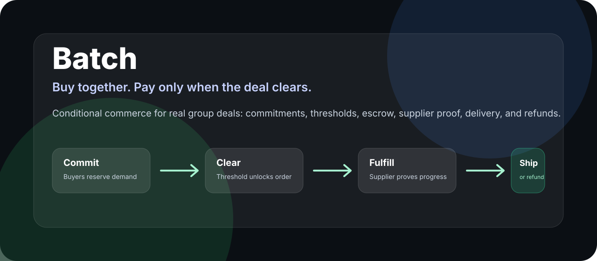
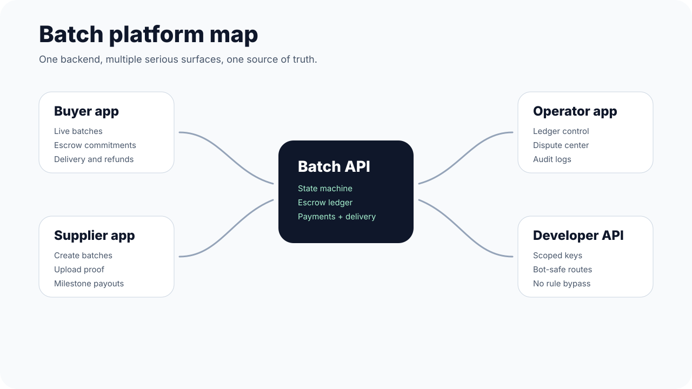

# Batch



**Buy together. Pay only when the deal clears.**

Batch is a conditional commerce platform for serious group deals. Buyers commit funds into a live batch, the deal clears only when enough demand forms, suppliers fulfill against milestone proof, and every buyer receives their own allocation. If the deal fails, funds move through the refund path instead of disappearing into chat-based promises.

It is not a small-store ecommerce template. Batch is a deal-clearing system built around commitments, thresholds, escrow, supplier proof, delivery allocation, disputes, and refunds.

## Why Batch exists

People already group-buy, preorder, import together, collect money in chats, and coordinate with suppliers manually. Demand exists. The hard problems are trust, timing, payment discipline, delivery proof, and clean refunds.

Batch turns scattered demand into committed money.

## What Batch does

```txt
Buyer commits money -> batch reaches threshold -> funds stay protected -> supplier proves progress -> order ships -> buyer receives allocation

If the threshold fails -> refund path starts
If proof fails -> operator review starts
If delivery splits -> each buyer still has an individual allocation record
```

## The product in one map



## Core surfaces

| Surface | Purpose |
| --- | --- |
| Buyer app | Discover live batches, commit funds, track escrow, manage slots, receive deliveries, request refunds, open disputes. |
| Supplier app | Create batch offers, submit proof, track milestones, receive approved payouts, manage fulfillment. |
| Operator app | Control escrow events, supplier checks, disputes, ledger postings, payment callbacks, delivery allocation, and audit logs. |
| Developer API | Scoped bot/API access for market reads, slot actions, and controlled order creation without bypassing Batch rules. |
| Public site | Clear product explanation for buyers, suppliers, partners, grant reviewers, and judges. |

## First wedge

Start with small merchant inventory batches where waiting can create a real price advantage:

- phone accessories
- beauty stock
- electronics accessories
- school supplies
- spare parts
- tools
- uniforms

These categories are planned purchases, easier to inspect than perishables, and practical for grouped demand.

## Trust model

Batch is designed around proof instead of promises:

- buyers do not rely on chat screenshots
- suppliers do not receive blind full upfront release
- operators can inspect ledger and payment events
- refunds are part of the product, not an afterthought
- delivery is split per buyer even when purchasing happens in bulk

## Architecture direction

Batch is API-first so the same backend can serve web, mobile, partner integrations, bot integrations, and future native apps.

```txt
apps/web       Web/PWA app and public site
apps/api       API service boundary and route contracts
packages/ui    Shared app design system
packages/core  Batch state machine and business rules
packages/db    Prisma schema and seed data
packages/payments Circle, Arc, local payment adapters
packages/logistics Delivery, pickup, tracking primitives
packages/notifications Email/SMS/WhatsApp adapters
packages/config Shared TypeScript, lint, env, constants
```

## Frontend direction

The frontend should feel like a serious financial-commerce app, not a generic shop theme:

- calm black, white, and soft neutral UI
- app-first navigation
- clear batch status language
- escrow and refund visibility
- supplier proof timeline
- operator-grade ledger and dispute views
- no fake success states where backend data is missing

The active frontend working branch is:

```txt
frontend-full-pass
```

## Starting template decision

Batch should start from a modern app/dashboard foundation, not an ecommerce storefront.

Recommended path:

```txt
fresh Next.js app
+ shadcn/ui blocks
+ Batch-specific dashboard screens
+ Prisma/Postgres
+ mock ledger
+ Circle/Arc adapters later
```

Read `docs/11-starting-template.md` before scaffolding UI.

## Start reading

1. `docs/00-product-brief.md`
2. `docs/01-architecture.md`
3. `docs/02-api-contract.md`
4. `docs/03-database.md`
5. `docs/04-ui-rules.md`
6. `docs/11-starting-template.md`
7. `AGENTS.md`
